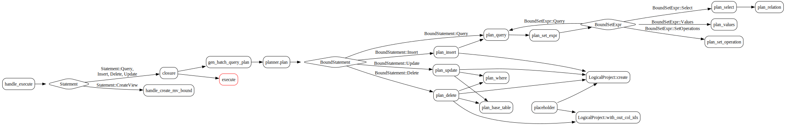
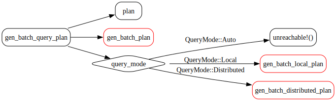
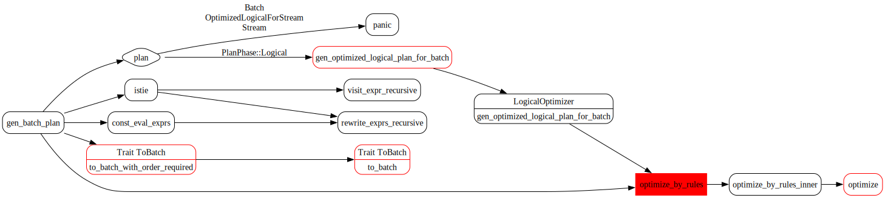

# 逻辑执行计划

## Binder

Binder 将 sql ast 中的标识符、表达式等解析成带有类型和表字段引用的“已绑定表达式”（如 ExprImpl），并生成 BoundStatement（BoundQuery、BoundSelect）。代码逻辑位于 `./src/frontend/src/binder`。

## Planner  

Planner 将 BoundStatement 转换为 crate::optimizer::plan_node::PlanNodePlanNode 树。代码逻辑位于 `./src/frontend/src/planner`。

handle_execute 会调用 gen_batch_query_plan，返回值为 RwPgResponse。

gen_batch_query_plan 接受一个 BoundResult（包含 BoundStatement 和 StatementType），返回值为 BatchQueryPlanResult。该方法在内部构造一个 Planner 然后调用其 plan 方法，最后返回一个PlanRoot，表示逻辑执行计划的根。根据 BoundStatement 的不同类型，plan 方法最终会选择执行某个 plan_* 方法，在其内部会不断递归构建逻辑计划的树。

### plan_query

plan_query 首先解构传入的 BoundQuery 参数得到 body, order, limit, offset, with_ties, extra_order_exprs。

其中 body 是一个 BoundSetExpr，是查询主体，可以是 select（BoundSelect）, union, except, intersect。而BoundSelect 又由 select的items, where, groupby, having 等构成。

它处理的大致流程为：

- 解构 BoundQuery
- 根据 body 和 排序信息生成初步逻辑计划
    - 这里面会进一步进行递归
- 处理 limit/offset
    - 优化 order key，去除冗余 order key
        - plan.functional_dependency() 方法会返回哪些列可以唯一决定其他列，之后minimize_order_key方法就是根据依赖集合去除冗余列，保留最小必要的**排序列**
            - 依次决定排序列的每个前缀，判断当前列是否可以被前缀唯一决定，为是，则可以裁剪
            - 考虑分布键的情况，分布键不能删
    - 设置 limit/offset 默认值
    - 如果没有 order key，创建 LogicalLimit
    - 如果有，创建 LogicalTopN
- 构造输出字段结合，排除额外的表达式，构造 PlanRoot

### gen_batch_query_plan

gen_batch_query_plan 的作用是**将绑定后的 sql（BoundResult）转换为可执行的批处理物理计划，并确定查询的执行模式（本地或分布式）等元信息。**

大致流程为：
- 解构 BoundResult
- 构建 planner，调用 plan 生成逻辑计划树（如LogicalProject、LogicalJoin）
- **调用 gen_batch_query，将逻辑计划转换为批处理物理计划**
- 使用 RelationCollectorVisitor 和 ReadStorageTableVisitor 收集本次查询涉及的表
- 结合 sql 模式、优化器判断和 session 配置决定是本地执行（QueryMode::Local）还是分布式执行（QueryMode::Distributed）
- **根据执行模式生成本地或分布式的执行计划，调用 gen_batch_local_plan 或者 gen_batch_distributed_plan**
- 构造 BatchQueryPlanResult 返回，包含物理计划、执行模式、schema、语句类型、依赖表等信息

### gen_batch_plan

是 PlanRoot 的方法，将逻辑计划（Logical Plan）优化并转换为本地（单节点）可执行的批处理物理计划（Batch Physical Plan）

- 如果 phase 是 Logical，先调用 gen_optimized_logical_plan_for_batch 进行逻辑优化
- 内联、常量、时区
    - 检查是否存在 batch 查询不支持的特性（temporal join），若有报错
    - 对表达式中的进行 session 时区内联处理（如 now()）
    - 常量折叠（const eval），提前计算常量表达式
- **调用 to_batch_with_order_required，将逻辑计划转换为物理计划，并满足所需的排序要求**
    - 如果逻辑计划中存在分布式算子（如分布式 join、分布式聚合等），在转换为本地物理计划时，优化器会尝试将其转化为单节点执行（比如通过收敛数据到一个节点）。
    - 外层对分布式 plan 处理的函数 为 gen_batch_distributed_plan，如 [gen_batch_query_plan](#gen_batch_query) 章节中图示
- **物理规则优化，依次应用一系列物理优化规则（如合并 BatchProject、Push Limit To Scan、Iceberg Count Star 等）**
- **校验**
    - 校验最终计划的分布为单节点（Distribution::Single）。
    - 校验计划中没有 BatchExchange 节点（即本地计划不允许分布式交换）。

PlanPhase 的变换

- `Logical` -> `OptimizedLogicalForBatch` -> `Batch`
- `Logical` -> `OptimizedLogicalForStream` -> `Stream`

### 几个 gen 函数

一开始看到 gen_batch_plan 和 gen_batch_local_plan 以及 gen_batch_distributed_plan，分不清它们的区别。

我自己的理解是，前者将逻辑计划转化为**初步的**物理计划，后两者则进一步去生成local的或者distributed的物理计划（对于 local 如果一定避免不了分布式，还会根节点插入 Exchange）。

在实际的查询处理流程中，生成分布式批处理计划的入口是 gen_batch_distributed_plan，而不是 gen_batch_plan。
但在 gen_batch_query_plan 这类入口函数中，**通常会先生成一个“通用的”批处理物理计划（不强制要求单节点）**，然后根据 query_mode 决定：
- 如果是分布式执行，走 gen_batch_distributed_plan。
- 如果是本地执行，走 gen_batch_local_plan，此时输入的 plan 可能是分布式的（比如聚合、Join 等分布式算子），需要强制收敛到单节点。

gen_batch_local_plan 的输入要求是已经是 Batch 阶段的物理计划（即 PlanPhase::Batch），但并不要求输入计划一定是单节点分布。
它的主要作用是：**无论输入的批处理物理计划是什么分布（单节点或分布式），都强制将其转换为本地（单节点）可执行的计划。**
- 如果输入计划已经是 Distribution::Single，则只需做一些额外检查和可能的 Exchange 插入。
- 如果输入计划是分布式（如 Distribution::HashShard），则会在根节点插入一个 BatchExchange，把所有数据收敛到单节点。

gen_batch_local_plan

根节点插入 Exchange（如有必要）
to_local_with_order_required 并不一定保证分布为单节点（Distribution::Single），因此这里判断：**如果当前分布不是单节点，或者需要额外的 Exchange（如根节点是 SeqScan/Source/Insert 等），就在根节点插入一个 BatchExchange，强制收敛到单节点。**

**gen_batch_local_plan最终会调用 LogicalOptimizer::gen_optimized_logical_plan_for_batch 这个函数，这个函数内部对逻辑计划应用一系列批处理场景下的优化规则（如谓词下推、投影下推、合并等），最后得到一个优化后的逻辑计划**  

