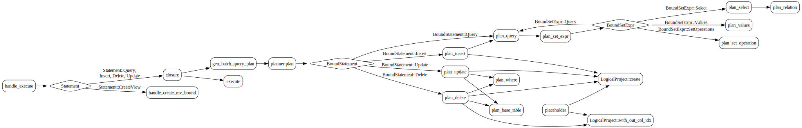

# 逻辑执行计划

## Binder

Binder 将 sql ast 中的标识符、表达式等解析成带有类型和表字段引用的“已绑定表达式”（如 ExprImpl），并生成 BoundStatement（BoundQuery、BoundSelect）。代码逻辑位于 `./src/frontend/src/binder`。

## Planner  

Planner 将 BoundStatement 转换为 crate::optimizer::plan_node::PlanNodePlanNode 树。代码逻辑位于 `./src/frontend/src/planner`。

gen_batch_query_plan 接受一个 BoundResult（包含 BoundStatement 和 StatementType），在内部构造一个 Planner 然后调用其 plan 方法，最后返回一个PlanRoot，表示逻辑执行计划的根。

而gen_batch_query_plan 的返回值为BatchQueryPlanResult。

handle_execute 返回值为 RwPgResponse。

## 
